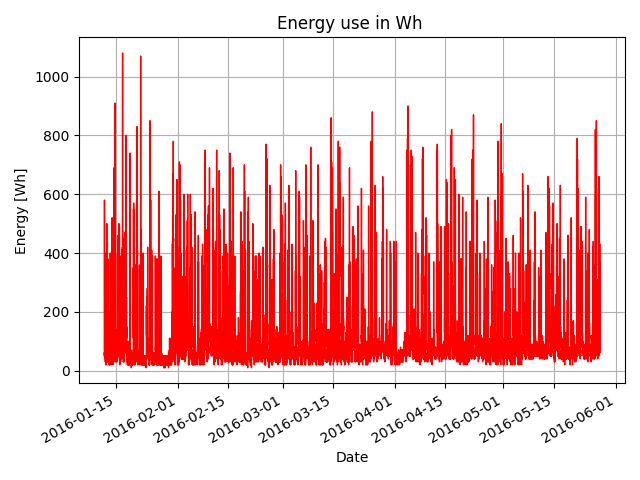

| Imię        | Nazwisko    | Numer Indeksu |
| :---        |    :----:   |          ---: |
| Mateusz     | Kowalczyk   | 268533        |

# Sprawozdanie Moduł 2 - Praca z danymi w systemie testowym/ kontroli jakości

## Cel zadania:  

Zadaiem naszym było stworzenie wykresów na podstawie danych z pliku: **energydata_complete**, a następnie dodanie ich do naszego repozytorium z uwzględnieniem:
- sprawozdania markodown: **sprawozdanie.md**, 
- pliku kodu: **zad.py** 
- pliku tekstowym: **requirements.txt**

## Co zrobiłem: 
- Wizualizacje danych w formie wykresu danych z domowego systemu IoT. Odbywało się to w języku python z pomoca takich bibliotek jak: **numpy**, **pandas**, **matplotlib**,
- Automatyczny zapis wykresów do folderu **/mod/graphs**,
- Wykres z wieloma danymi na jednym wykresie oraz wiele wykresów jako subplots,
- Praca z debuggerem,
- Zaprojektowanie sprawozdania markdown przedstawiającego nasze postępy,
- Praca z Git/Github.


## Wyniki:  
### Wczytanie danych z pliku .csv:
```python
# wczytanie pliku .csv:
plik = pd.read_csv('student/mod2/energydata_complete.csv') 
plik['date'] = pd.to_datetime(plik['date'])
```
### Wykres zużycia energii dla urządzeń elektrycznych:

#### Kod:
```python
# tworzenie wykresu (os X: Data, os Y: Zużycie energii):
plt.plot(plik['date'], plik['Appliances'], color = 'red', lw=1) 
# opisy osi:
plt.xlabel('Date')
plt.ylabel('Energy [Wh]')
plt.title('Energy use in Wh ')
plt.grid(True)
plt.gcf().autofmt_xdate()
plt.tight_layout()
plt.savefig('student/mod2/graphs/Energy.png')
plt.show()
```

### Wykres zużycia energii oświetlenia:

#### Kod:

```python
plt.plot(plik['date'], plik['lights'], color = 'green', lw=1)
plt.xlabel('Date')
plt.ylabel('Energy [Wh]')
plt.title('Energy use of light fixtures in the house in Wh')
plt.grid(True) # włącz siatke
plt.gcf().autofmt_xdate() # autoformat osi X
plt.tight_layout() # poprawia układ wykresu
plt.savefig('student/mod2/graphs/Energy2.png')
plt.show()
```
### Wykres zużycia energii oświetlenia:
.")
#### Kod:

```python
plt.scatter(plik['date'], plik['Press_mm_hg'], color = 'blue', linewidths=0.2)
plt.xlabel('Date')
plt.ylabel('Pressure [mm Hg]')
plt.title('Pressure (from Chievres weather station)')
plt.grid(True)
plt.gcf().autofmt_xdate()
plt.tight_layout()
plt.savefig('student/mod2/graphs/Pressure.png')
plt.show()
```
### Temperatura w poszczególnych miejscach w budynku:

#### Kod:
```python
plt.subplot(131)
plt.plot(plik['date'], plik['T1'], label = 'kitchen', lw=1)
plt.plot(plik['date'], plik['T2'], label = 'living room', lw=1)
plt.plot(plik['date'], plik['T3'], label = 'laundry room', lw=1)
plt.legend()
plt.ylabel('Temperature [°C]')
plt.subplot(132)
plt.plot(plik['date'], plik['T4'], label = 'office room', lw=1)
plt.plot(plik['date'], plik['T5'], label = 'bathroom', lw=1)
plt.plot(plik['date'], plik['T7'], label = 'ironing room', lw=1)
plt.legend()
plt.subplot(133)
plt.plot(plik['date'], plik['T8'], label = 'teenager room', lw=1)
plt.plot(plik['date'], plik['T9'], label = 'parents room', lw=1)  
plt.legend()
plt.suptitle('Temperature in every area inside.')
plt.grid(True)
plt.gcf().autofmt_xdate()
plt.tight_layout()
plt.savefig('student/mod2/graphs/Temp.png')
plt.show()
```
### Temperatura na zewnątrz z uwzględnieniem aproksymacji:

#### Kod:
```python
days_ts_list=(plik['date']-plik['date'][0]).dt.total_seconds()/(3600*24)
z = np.polyfit(days_ts_list, plik['T6'], 1)
p = np.poly1d(z)
plt.scatter(plik['date'], plik['T6'], linewidths= 0.2)
plt.plot(plik['date'], p(days_ts_list), color = 'red', lw=3)
plt.xlabel('Date')
plt.ylabel('Temperature [°C]')
plt.title('Temperature outside [°C] with Linear Fit')
plt.grid(True)
plt.gcf().autofmt_xdate()
plt.tight_layout()
plt.savefig('student/mod2/graphs/Temp2.png')
plt.show()
```


